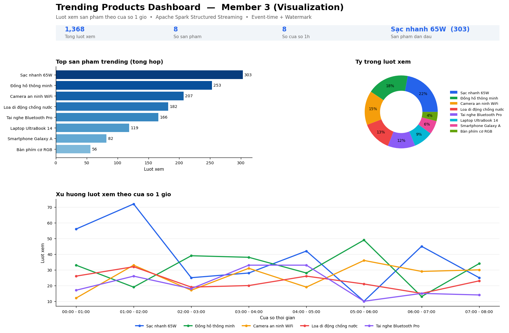

# Thành viên 3 — Visualization & Dashboard

Phần này nhận **output trending products** từ pipeline Spark Structured Streaming của
**Thành viên 2** (`trending_products.py`) và biến nó thành một **dashboard trực quan,
realtime** để phân tích xu hướng sản phẩm.

> Theo tài liệu (mục 15–16.8): Thành viên 3 dùng dataframe kết quả
> `window | product_id | count` để **vẽ biểu đồ, hiển thị dashboard, lưu dữ liệu,
> và trình bày báo cáo**. Repo này hiện thực hóa đúng các nhiệm vụ đó.



---

## 1. Kiến trúc — vị trí của Thành viên 3 trong hệ thống

```
[TV1] Kafka Producer
        │
        ▼
   Kafka Topic (ecommerce-events)
        │
        ▼
[TV2] Spark Structured Streaming   ← trending_products.py
        │  (event-time + watermark + window 1h + count)
        ▼
   ┌──────────────────────────────┐
   │  trending_sink.py  (CẦU NỐI)  │  ← ghi kết quả mỗi micro-batch xuống SQLite
   └──────────────────────────────┘
        │
        ▼
     trending.db  (SQLite)
        │
        ▼
[TV3] dashboard.py (Streamlit)      ← ĐỌC + TRỰC QUAN HÓA  ◀── PHẦN CỦA BẠN
```

**Vấn đề đã giải quyết:** pipeline gốc của TV2 chỉ ghi ra `console` (mục 13), dashboard
không đọc được. `trending_sink.py` thêm một sink ghi xuống SQLite làm nguồn dữ liệu cho dashboard.

---

## 2. Danh sách file

| File | Vai trò |
| --- | --- |
| `dashboard.py` | **Dashboard chính** (Streamlit + Plotly): KPI, top sản phẩm, xu hướng theo thời gian, heatmap, bảng dữ liệu, tải CSV, tự động làm mới. |
| `trending_sink.py` | Cầu nối: ghi kết quả streaming của TV2 xuống SQLite (`foreachBatch`). Có thể chạy trọn gói thay cho `trending_products.py`. |
| `data_source.py` | Lớp đọc dữ liệu (tách khỏi giao diện để dễ đổi nguồn: SQLite → PostgreSQL/CSV...). |
| `generate_mock_data.py` | Sinh dữ liệu mẫu để **demo dashboard mà không cần Kafka/Spark**. |
| `requirements.txt` | Thư viện cần cài cho phần dashboard. |

---

## 3. Cài đặt

```bash
cd trending_project
pip install -r requirements.txt
```

Dashboard **không cần** PySpark/Kafka. Chỉ `trending_sink.py` mới cần khi chạy chung với Spark.

---

## 4. Chạy nhanh (chế độ DEMO — không cần Kafka/Spark)

Dùng khi làm slide, quay demo, hoặc phát triển giao diện:

```bash
# Bước 1: sinh dữ liệu mẫu
python generate_mock_data.py            # tạo 8 cửa sổ 1 giờ
#   hoặc giả lập realtime (cập nhật liên tục):
python generate_mock_data.py --live --interval 5

# Bước 2: mở dashboard
streamlit run dashboard.py
```

Dashboard mở tại `http://localhost:8501`. Bật **"🔄 Tự động làm mới"** ở thanh bên để xem
dữ liệu cập nhật realtime (kết hợp với `--live`).

---

## 5. Chạy thật (kết nối với pipeline của Thành viên 2)

**Cách A — sửa 3 dòng trong `trending_products.py`** (giữ nguyên file của TV2, chỉ đổi sink):

```python
from trending_sink import write_to_sqlite, init_db
init_db()

query = top_products.writeStream \
    .outputMode("complete") \
    .foreachBatch(write_to_sqlite) \   # thay cho .format("console")
    .start()
query.awaitTermination()
```

**Cách B — chạy trọn gói** (file `trending_sink.py` đã chứa lại toàn bộ pipeline của TV2):

```bash
# Terminal 1 & 2: chạy Zookeeper + Kafka (mục 16.3)
# Terminal 3: chạy pipeline + sink
spark-submit --packages org.apache.spark:spark-sql-kafka-0-10_2.12:3.5.0 trending_sink.py
# Terminal 4: mở dashboard
streamlit run dashboard.py
# Terminal 5: gửi dữ liệu test vào Kafka (mục 16.5)
```

Sau khi gửi event `view` vào Kafka, sink ghi xuống `trending.db`, dashboard tự cập nhật.

---

## 6. Tính năng dashboard

- **KPI tổng quan:** tổng lượt xem, số sản phẩm, số cửa sổ 1h, sản phẩm dẫn đầu.
- **Top N sản phẩm trending** (bar chart) — lọc theo cửa sổ thời gian hoặc tổng hợp.
- **Tỷ trọng lượt xem** (donut chart).
- **Xu hướng theo thời gian** (line chart đa sản phẩm) — phân tích sản phẩm đang lên/xuống.
- **Heatmap Sản phẩm × Cửa sổ** — nhìn nhanh "điểm nóng".
- **Bảng dữ liệu chi tiết** đúng output của TV2 + **nút tải báo cáo CSV** (lưu kết quả).
- **Tự động làm mới** mô phỏng realtime.

---

## 7. Schema dữ liệu (bảng `trending_products` trong SQLite)

| Cột | Kiểu | Ý nghĩa |
| --- | --- | --- |
| `window_start` | TEXT | Đầu cửa sổ 1 giờ |
| `window_end` | TEXT | Cuối cửa sổ 1 giờ |
| `product_id` | TEXT | Mã sản phẩm |
| `view_count` | INTEGER | Số lượt xem (`count`) |
| `updated_at` | TEXT | Thời điểm cập nhật |

Tương ứng với dataframe ở mục 16.7: `window | product_id | count`.
